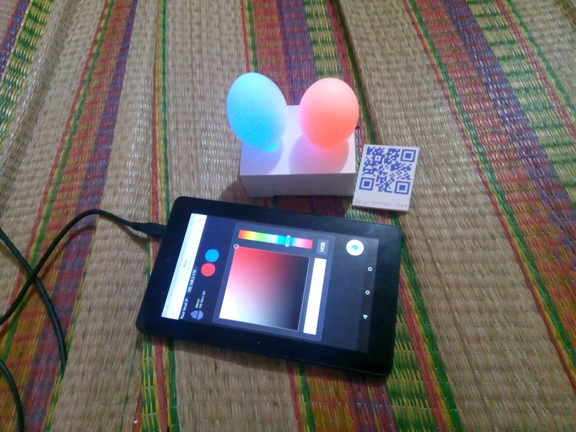
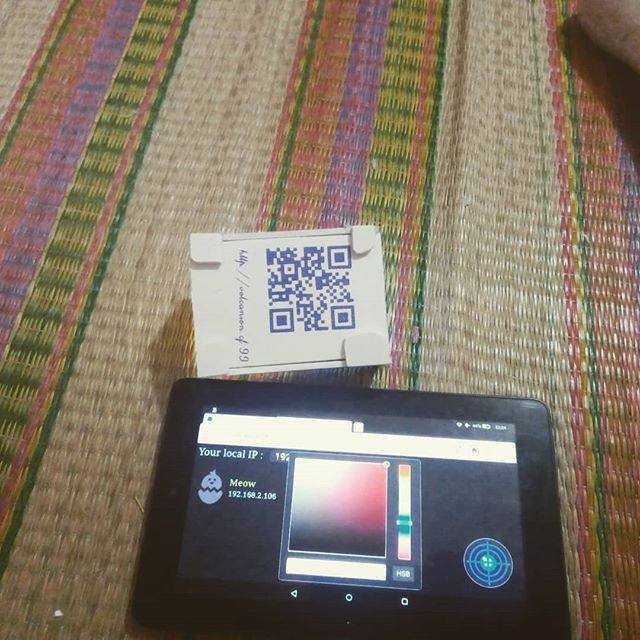

# EGG LAMP - ESP8266-12F

## Overview




## Web server

To control device, you can visit my website: 
http://www.volcanion.cf:99
For quickly, I make a QRCode, we can you some app(like Viber, Mocha, Zalo...) to scan it.

Or host it by runing the command:

```
    node server.js
```

> This webpage only run in http protocal(not https), because esp use http server, we can not scan device in local network with https

## For developer

* Make android app by using webview
* More feature: control via internet with socket.io, MQTT
* Setup device : setup SSID, password in the first time, reset setting
* More device type

